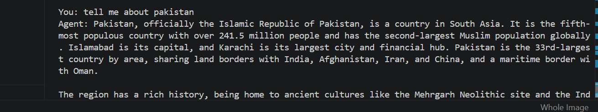

# 🤖 Gemini CLI Agent

A lightweight tool-calling AI assistant built with Python and Google's Gemini API.

The assistant uses Gemini's function-calling capability to interact with external tools such as a calculator and DuckDuckGo web search while providing an interactive command-line chat experience.

## 📸 Demo



---

## ✨ Features

* 🤖 Gemini-powered conversational assistant
* ➕ Calculator tool for basic arithmetic operations
* 🌐 Web search using DuckDuckGo
* 🔧 LLM function/tool calling
* 💬 Interactive command-line interface
* 🔐 Secure API key management using environment variables
* ⚠️ Basic API error handling

---

## 🛠️ Tech Stack

* Python 3
* Google Gemini API
* `google-genai` SDK
* DuckDuckGo Search (`ddgs`)
* `python-dotenv`

---

## 📂 Project Structure

```text
gemini-cli-agent/
│
├── screenshots/
│   └── demo.png
│
├── agent.py
├── config.py
├── tools.py
├── README.md
├── requirements.txt
├── .env.example
├── .gitignore
└── LICENSE
```

---

## 🚀 Installation

### 1. Clone the repository

```bash
git clone https://github.com/MuhammadOsama03/gemini-cli-agent.git
```

### 2. Move into the project directory

```bash
cd gemini-cli-agent
```

### 3. Create a virtual environment

```bash
python -m venv venv
```

### 4. Activate the virtual environment

**Windows**

```bash
venv\Scripts\activate
```

**Linux / macOS**

```bash
source venv/bin/activate
```

### 5. Install the dependencies

```bash
pip install -r requirements.txt
```

---

## 🔑 Environment Variables

Create a `.env` file in the project root and add your Gemini API key:

```env
GEMINI_API_KEY=YOUR_API_KEY_HERE
```

You can use `.env.example` as a template.

> Never commit your actual `.env` file or API key to GitHub.

---

## ▶️ Usage

Start the assistant with:

```bash
python agent.py
```

Then interact with it directly from the terminal.

### Example

```text
🤖 CLI Research Agent (type 'exit' to quit)

You: Explain object-oriented programming in one sentence.
Agent: Object-oriented programming is...

You: Search the web for the latest Python release.
Agent: ...
```

Type `exit` or `quit` to close the assistant.

---

## 🧠 How It Works

```text
User Input
    │
    ▼
Gemini Model
    │
    ├── Direct Response
    │
    └── Tool Selection
          │
          ├── Calculator
          │
          └── Web Search
                  │
                  ▼
             Tool Result
                  │
                  ▼
             Gemini Response
```

Gemini receives the user's request and determines whether it can respond directly or whether an available tool may be useful. The Python application provides the available tools and manages the CLI conversation.

---

## ⚠️ Limitations

* Tool selection is controlled by the Gemini model, so simple tasks may be answered directly without invoking an available tool.
* Web search currently uses search-result snippets rather than retrieving and verifying complete web pages.
* Conversation context is limited to the current CLI session and is not stored persistently.
* Gemini API requests are subject to the quotas and rate limits associated with the configured API key.

---

## 🔮 Possible Future Improvements

* Persistent conversation memory
* Additional external tools
* Improved web-source retrieval and verification
* More detailed tool-use visibility
* Automated tests

---

## 📄 License

This project is licensed under the MIT License.
